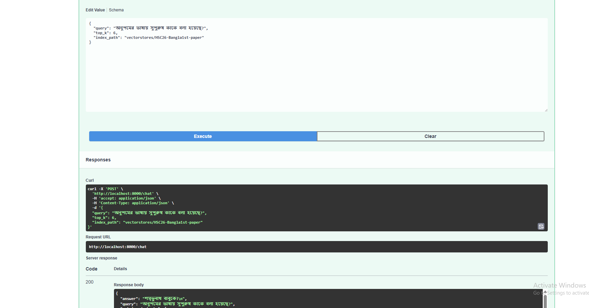
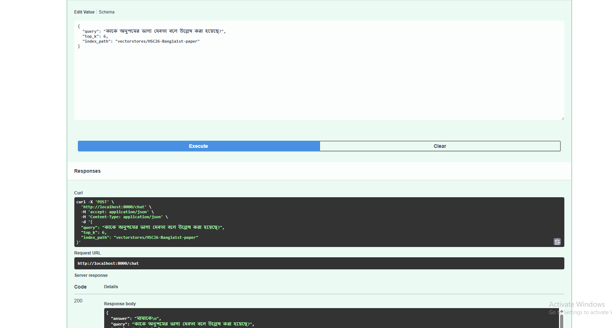
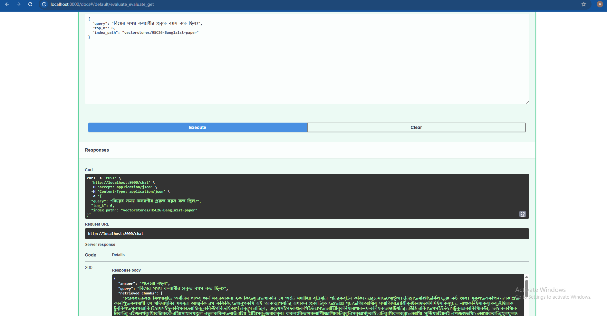
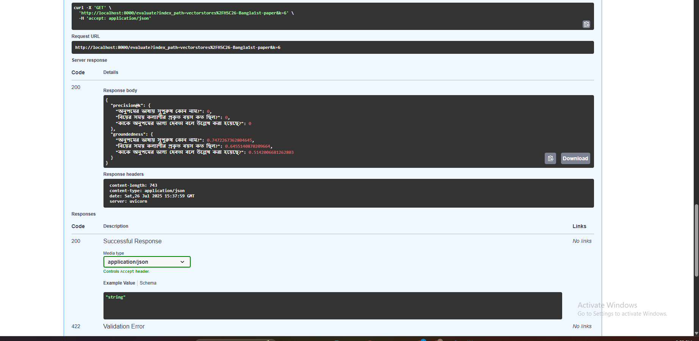

# 📚 Multilingual Retrieval-Augmented Generation (RAG) System


A Retrieval-Augmented Generation (RAG) pipeline for answering questions in **Bengali**  using PDF documents  but accept queries in Both languages **English** and  **Bangla**. This project demonstrates how to process Bengali text, chunk, embed, index, and retrieve document segments for accurate semantic question answering.

---

## 🚀 Setup Guide

### 1. Clone the Repo
```bash
git clone https://github.com/amirhamzha/RAG-based-Bengali-QA-System-using-Gemini-FAISS.git
cd bengali-rag-qa
```

### 2. Setup Virtual Environment
```bash
python -m venv rag-env
rag-env\Scripts\activate  # On Windows
```

### 3. Install Requirements
```bash
pip install -r requirements.txt
```

### 4. Add `.env` File
```bash
GOOGLE_API_KEY=your_google_gemini_api_key
```

### 5. Run the Pipeline
```bash
python main.py        # To generate FAISS index
```
### 6. uvicorn api:app --reload --port 8000   #to run front-end
then go to the listed url 

```bash

http://localhost:8000/docs
```


## 🛠️ Tools, Libraries, and Packages Used
```bash
- **LangChain**: Framework for chaining LLMs with retrievers and indexes.
- **FAISS**: Fast vector similarity search.
- **Google Gemini API**: LLM for answering in Bengali.
- **HuggingFace Embedding Models**: Multilingual sentence embeddings.
- **PyMuPDF (fitz)**: Accurate Bengali PDF extraction.
- **dotenv**: Load API keys securely.
```

## 🔍 Sample Queries & Outputs
```bash
### Input: অনুপমের ভাষায় সুপুরুষ কাকে বলা হয়েছে?
**Output:** শুম্ভুনাথ

### Input: বিয়ের সময় কল্যাণীর প্রকৃত বয়স কত ছিল?
**Output:** ১৫ বছর

#after going to the specific url listed url 
 http://localhost:8000/docs

you find fast-api frontend and there is method listed below how to user input 

```


## 📖 API Documentation ()

APi references for chat and query
Run the server:
```bash
uvicorn api:app --reload --port 8000
```

Open http://localhost:8000/docs

Expand POST /chat, click Try it out, enter your query, click Execute.

```
#in the place of your query write you query and press execute you can play with top_k tune parameters but do not touch index_path
{
  "query": "বিয়ের সময় কল্যাণীর প্রকৃত বয়স কত ছিল?",
  "top_k": 6,
  "index_path": "vectorstores/HSC26-Bangla1st-paper"
}

```
then press excute you will your query and answer and retrieved chunks


##  responese 
```
{
  "query": "বিয়ের সময় কল্যাণীর প্রকৃত বয়স কত ছিল?",
  "answer": "১৫ বছর",
  "retrieved_chunks": [
    "… relevant chunk text 1 …",
    "… relevant chunk text 2 …",
    "…"
  ]
}

```

### API reference for evalaution

if server is running already running then skip  Run the server
if not running then 


```bash
uvicorn api:app --reload --port 8000
```

```
Open http://localhost:8000/docs

Expand GET /evaluate, click Try it out, then Execute.
```
##  responese 
```
{
  "precision@k": {
    "অনুপমের ভাষায় সুপুরুষ কোন নাম?": 1,
    "বিয়ের সময় কল্যাণীর প্রকৃত বয়স কত ছিল?": 1,
    "কাকে অনুপমের ভাগ্য দেবতা বলে উল্লেখ করা হয়েছে?": 0
  },
  "groundedness": {
    "অনুপমের ভাষায় সুপুরুষ কোন নাম?": 0.75,
    "বিয়ের সময় কল্যাণীর প্রকৃত বয়স কত ছিল?": 0.64,
    "কাকে অনুপমের ভাগ্য দেবতা বলে উল্লেখ করা হয়েছে?": 0.51
  }
}
``` 


### Questions and Answer

### 1️⃣ What method or library did you use to extract the text, and why?
We used **PyMuPDF (`fitz`)** because it handles complex Bengali fonts and multi-column layouts better than older libraries like PyPDF2. It keeps Unicode glyphs intact, which is essential for Bengali text where font encoding can be inconsistent.

---

### 2️⃣ What chunking strategy did you choose?
We used **character-level chunking** with `RecursiveCharacterTextSplitter` — chunk size **5000** characters, overlap **1100**. This keeps context intact across chunks, which is important for literature or narrative text. The overlap helps catch partial ideas that might otherwise split awkwardly.

---

### 3️⃣ What embedding model did you use?
We used `sentence-transformers/paraphrase-multilingual-MiniLM-L12-v2`. It’s a fast, multilingual model that performs well on Bengali and other low-resource languages. It captures paraphrase-level meaning, so different phrasings map to similar vectors. It’s also lightweight enough for local or small-server deployment.

---

### 4️⃣ How are you comparing the query with your stored chunks? Why did you choose this similarity method and storage setup?
Each chunk is embedded the same way as the user query, then stored in a **FAISS** vector index. At query time, we embed the input and run a cosine similarity search.  
Cosine similarity works well for high-dimensional semantic vectors because it measures their direction, which matches how these embeddings encode meaning. FAISS provides super fast nearest-neighbor search even for large document sets.

---

### 5️⃣ How do you ensure meaningful query–document comparison?
We combine semantic embeddings with overlap-based chunking to keep context relevant. We always retrieve the top‑K most similar chunks to pass to Gemini.  
If a query is too vague (e.g. “Who?” or “When?”) the similarity scores will drop — we can detect that and ask the user to clarify or fallback to a simpler keyword search.

---

### 6️⃣ Are results relevant? What could improve them?
So far, the results are strong for factual questions. To improve even more, we could:  
- Tune chunk size and overlap to fit different source types.  
- Use a more powerful paid embedding model.  
- Switch to a stronger LLM (Gemini paid or OpenAI GPT-4) for deeper reasoning.  
- Add a reranker step to refine top-K results for edge cases or ambiguous queries.


---


## Illustrations




### 2. query-2 



---

### 3. query-3  


---

### 4. evaluation  



###📌 Project Summary 

This project implements a Retrieval-Augmented Generation (RAG) based Question Answering (QA) system designed primarily for the Bengali language, while also allowing users to ask questions in English. It combines the power of Gemini language models with FAISS (Facebook AI Similarity Search) to enable efficient semantic search and retrieval over large Bengali text corpora.

Key features include:

Document Embedding & Indexing: Bengali documents are embedded into vector representations using Gemini models and indexed using FAISS for fast similarity search.

Multilingual Question Support: Users can ask questions in both Bengali and English, making the system flexible and accessible to a wider audience.

Retrieval Augmentation: When a question is asked, the system retrieves relevant document chunks from the FAISS index to provide context.

Answer Generation: Using the retrieved context, the Gemini language model generates accurate and context-aware answers in Bengali.

Multilingual and low-resource language support: Tailored to address challenges of Bengali NLP with state-of-the-art transformer models.

Use cases: Useful for educational tools, customer support bots, and information retrieval for Bengali-speaking users and bilingual audiences.

The system bridges the gap in Bengali NLP by integrating advanced retrieval and generation techniques to deliver precise QA performance in a multilingual, low-resource language settin

---